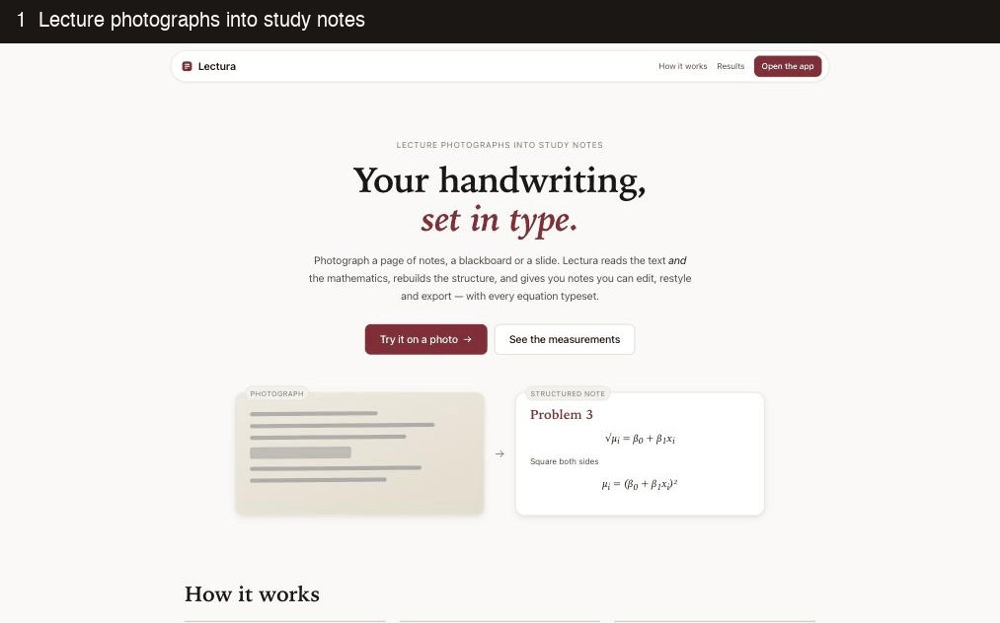

# Lectura

Photograph handwritten notes, a blackboard or a slide, and get back structured,
editable study notes with every equation typeset.

**[Try it live](https://lectura-murex.vercel.app)** · reads photos on a free GPU
through a [Hugging Face Space](https://huggingface.co/spaces/Jainil19/lectura) ·
no sign-up, nothing stored



## What it does

- **Reads text and mathematics** from real lecture photos, including phone HEIC
  files, and writes the mathematics as LaTeX.
- **Rebuilds the structure** - headings, lists, equations, multi-line
  derivations aligned on their `=` - as one canonical note, independent of how
  it looks.
- **Lets you correct it**: click any block to edit it with a live equation
  preview, re-type blocks, reorder, undo, switch themes, export Markdown.
- **Admits doubt**: uncertain blocks are flagged for review beside the source
  photo, and confirming a block is recorded separately from editing it, so what
  came off the page is never silently relabelled.

## How good is it?

Every backend is scored against transcriptions written by hand, never copied
from model output. Text and mathematics are scored separately, because
classical OCR fails on notation long before it fails on prose.

Four handwritten notebook pages, raw photos at 2200px, lower is better:

| Backend | Size | Text error (CER) | Formula error | Exact formulas |
|---|---|---|---|---|
| Tesseract | - | 1.058 | 0.997 | 0/28 |
| Pix2Text | - | 0.687 | 0.514 | 1/28 |
| Qwen3.5 0.8B | 0.8B | 0.608 | 0.548 | 2/28 |
| Qwen3.5 2B | 2B | 0.328 | 0.174 | 2/28 |
| Qwen3.5 4B | 4B | 0.313 | 0.148 | 1/28 |
| Qwen2.5-VL 7B | 7B | **0.225** | 0.159 | **7/28** |
| **GLM-OCR** (deployed) | **0.9B** | 0.241 | **0.124** | 3/28 |

GLM-OCR makes the fewest formula errors at under a quarter of the runner-up's
size. The hosted Space was scored the same way and matches the benchmark
(formula error 0.123) while reading four pages in 23 seconds instead of 201 on
an M4.

Four pages catch a large regression and settle nothing close. The labelled set
also holds boards and slides now; see [ARCHITECTURE.md](ARCHITECTURE.md) for
what was measured, including the fixes that looked right and measured worse.

## How it works

```
photo ──► decode ──► model reads the page ──► structure ──► note ──► edit · theme · export
          (HEIC,     (GLM-OCR: Markdown        (typed blocks,
          rotation)   with LaTeX)               derivations, loops
                                                collapsed)
```

Reading and organising are deliberately separate stages. Vision models read
handwriting well but type document structure unreliably, so structuring runs on
text alone: deterministic, unit-tested, and fixable without touching the model.
Every backend sits behind one interface, so the baselines stay runnable and any
claim of improvement can be re-measured with a flag.

| Part | Where |
|---|---|
| Web app (React, KaTeX) | `frontend/`, deployed on Vercel |
| GPU reading service (Gradio, ZeroGPU) | `space/`, deployed with `python space/deploy.py` |
| Pipeline, structuring, schema | `src/lectura/` |
| Evaluation harness and labelling tool | `src/lectura/evaluate/`, `data/eval/` |

## Run it locally

Requires Python 3.11+ and [Ollama](https://ollama.com).

```bash
uv venv && source .venv/bin/activate
uv pip install -e ".[dev]"
ollama pull glm-ocr

uvicorn lectura.api:app --port 8901        # web app at http://localhost:8901
lectura path/to/photo.heic --theme academic   # or the command line
```

Build the web app into the API first with `cd frontend && npm install && npm run build`;
`npm run dev` serves it with hot reload against port 8901.

## Measure it

```bash
lectura-eval                                   # GLM-OCR on the labelled set
lectura-eval -m qwen2.5vl:7b                   # any Ollama vision model
lectura-eval -b tesseract                      # baselines: tesseract, pix2text
lectura-eval --cached-only --surface notebook  # re-score without calling a model
lectura-label data/eval/images/boards --surface board   # add references by hand
```

Raw model output is cached per page and configuration, so a change to
structuring or scoring is re-measured in under a second.

## Development

```bash
pytest && ruff check .                          # Python tests and lint
cd frontend && npx tsc --noEmit && npm test     # type check and UI tests
```

CI runs both on every push.

## Privacy

Lecture photographs can contain people and copyrighted teaching material.
Images are processed in memory and never stored. Evaluation photos are
gitignored; each reference records where its image came from and under what
licence.

## Licence

MIT - see [LICENSE](LICENSE). GLM-OCR is MIT-licensed by Z.ai.
